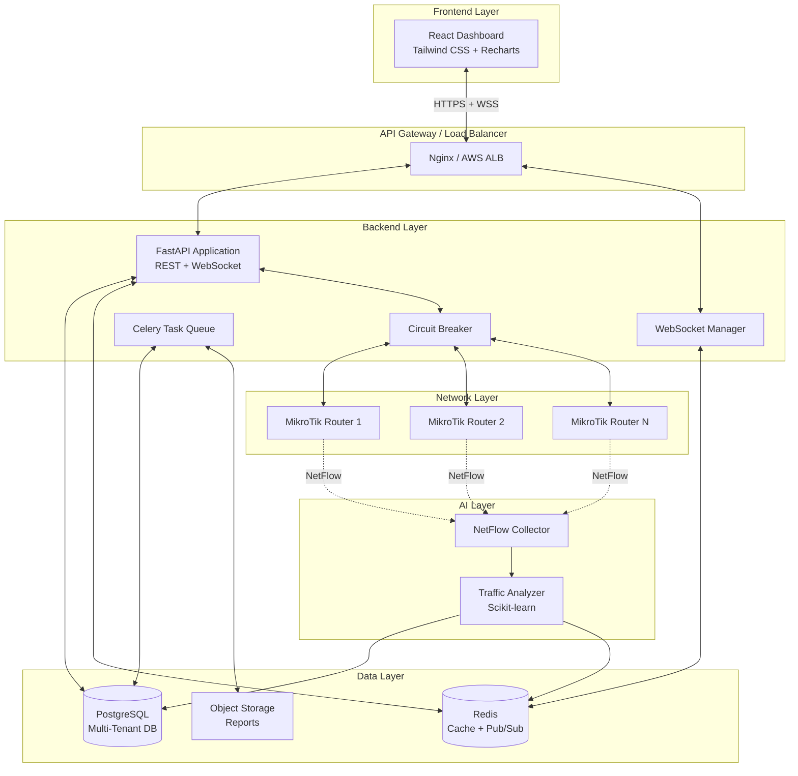
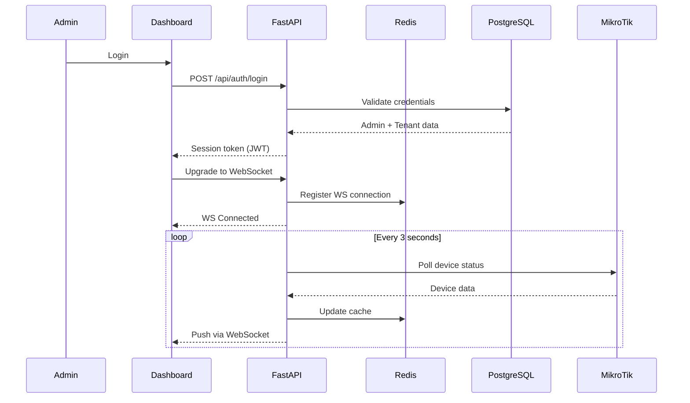
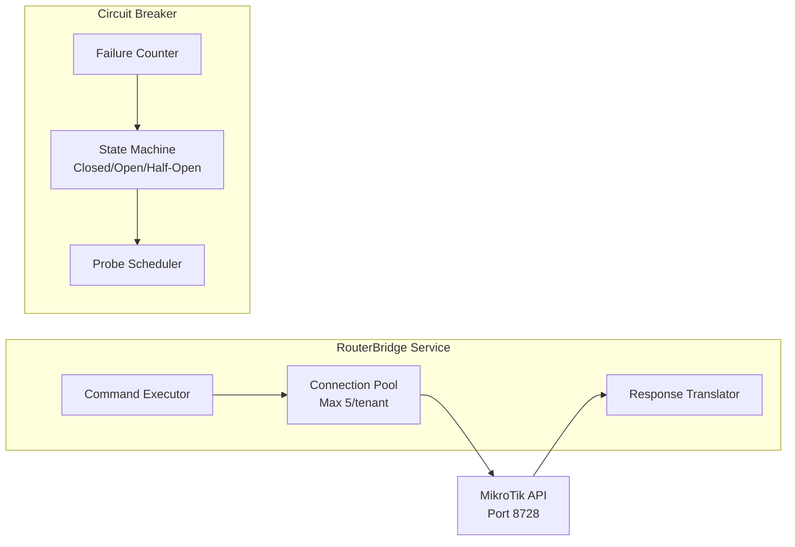
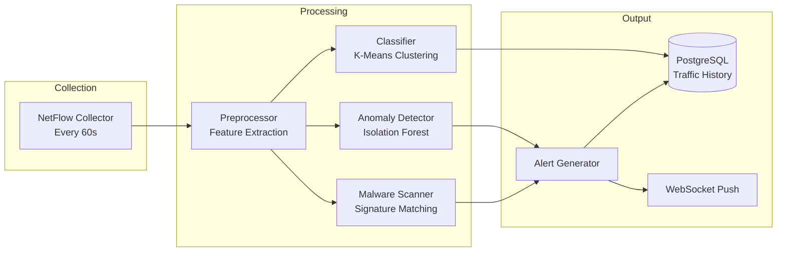
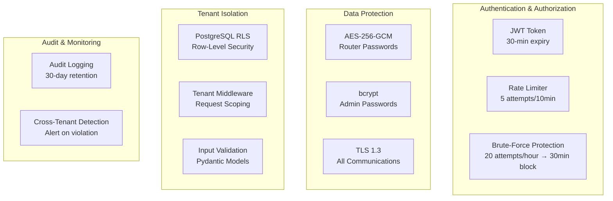
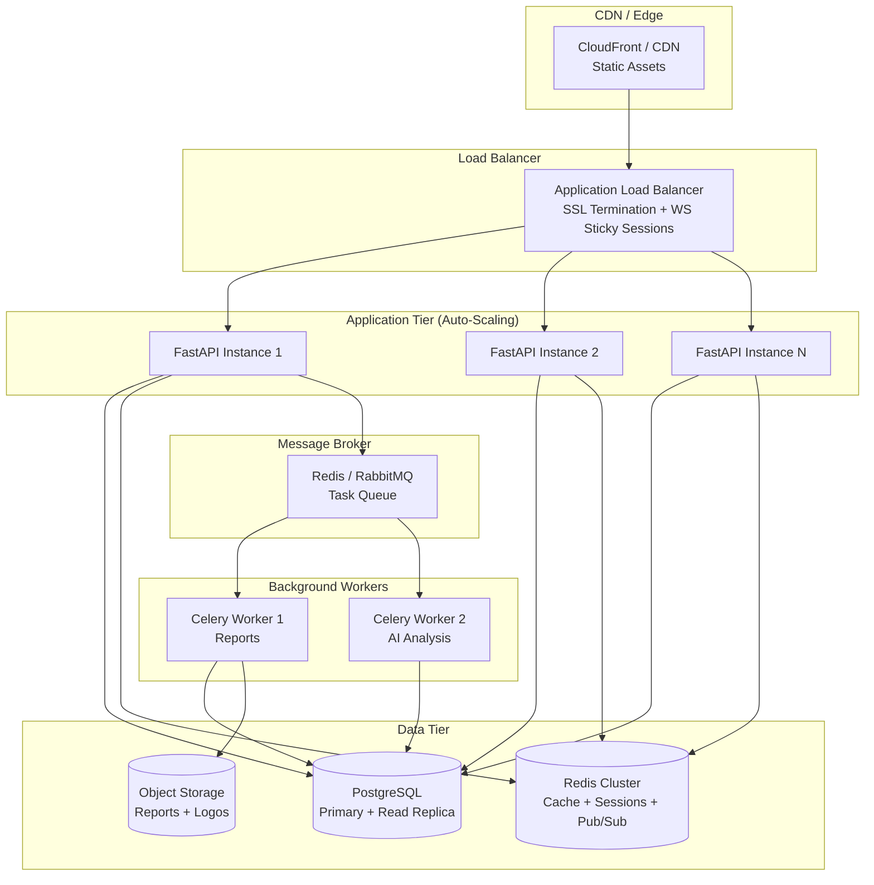
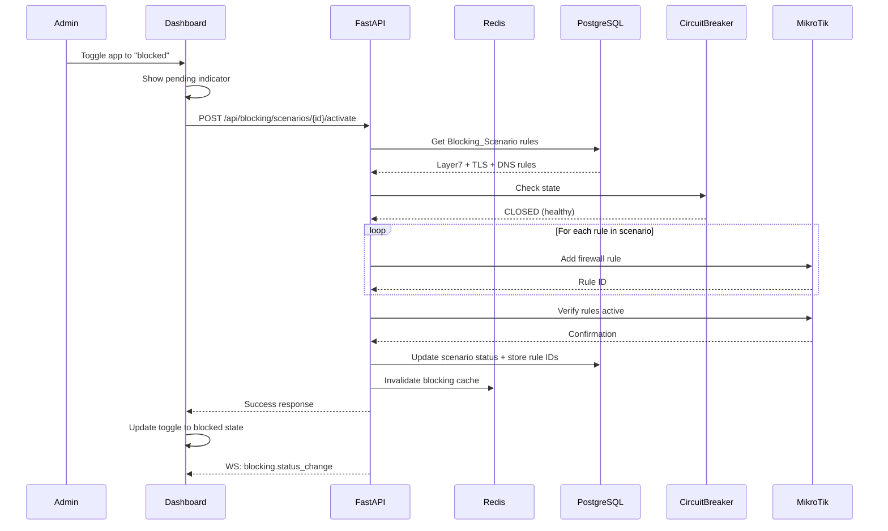
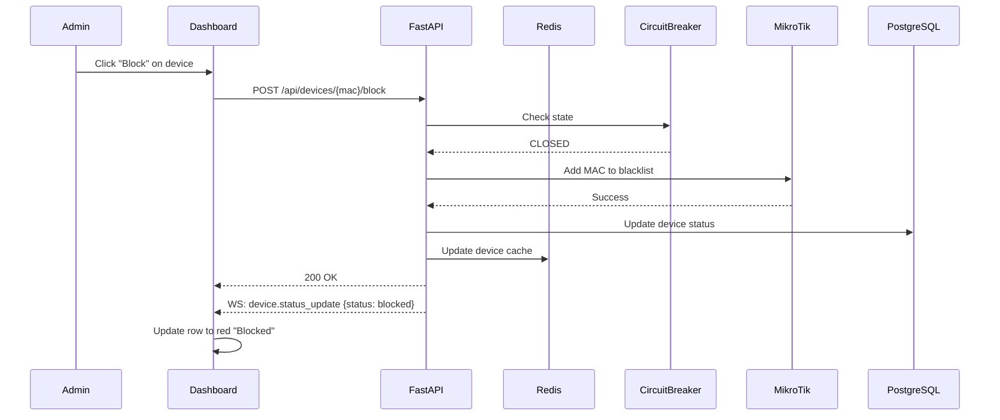
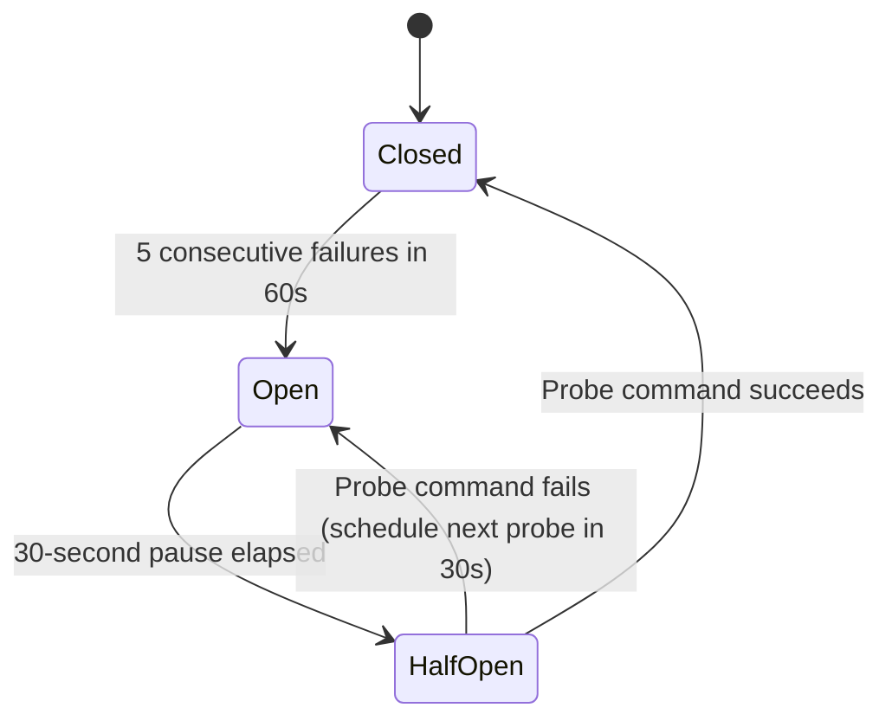

# Design Document: Smart WiFi Dashboard

## Overview

The Smart WiFi Dashboard is a multi-tenant SaaS platform that provides network administrators with real-time monitoring, device management, application blocking, bandwidth control, and AI-powered traffic analysis for MikroTik routers. The system follows a three-tier architecture: a React frontend with Tailwind CSS for the dark-mode dashboard UI, a Python FastAPI backend handling business logic and MikroTik router communication, and a data layer combining PostgreSQL (multi-tenant persistence), Redis (caching and real-time state), and Scikit-learn (AI traffic analysis).

Key design decisions:
- **Multi-tenant isolation via row-level security** in PostgreSQL with tenant_id scoping on all queries
- **WebSocket-first real-time communication** with HTTP polling fallback for resilience
- **Circuit breaker pattern** for MikroTik router communication to prevent cascade failures
- **Async task processing** for report generation and AI analysis pipelines
- **Connection pooling** per tenant for MikroTik API connections (max 5 per tenant)

## Architecture

### High-Level Architecture Diagram



### System Interaction Flow



## Components and Interfaces

### Frontend Components

| Component | Responsibility | Technology |
|-----------|---------------|------------|
| `AuthModule` | Login form, session management, token refresh | React + React Router |
| `DashboardOverview` | Info cards, real-time traffic graph, AI alerts | Recharts + WebSocket hook |
| `DeviceManager` | Device table, kick/block/limit actions | React Table + REST API |
| `AppBlocker` | Application cards with toggle switches | React + REST API |
| `BandwidthControl` | Global slider, VIP list, per-device overrides | React Slider + REST API |
| `AnalyticsView` | Traffic charts, anomaly timeline, report export | Recharts + REST API |
| `SettingsPanel` | Router config, connection test, profile | React Forms + REST API |
| `WebSocketProvider` | WS connection lifecycle, reconnection, fallback | Custom React Context |
| `NotificationCenter` | Alert toasts, notification bell, unread count | React + WebSocket |

### Backend Services

| Service | Responsibility | Interface |
|---------|---------------|-----------|
| `AuthService` | Authentication, session management, rate limiting | REST API |
| `TenantService` | Tenant isolation, scoping middleware | Internal middleware |
| `DeviceService` | Device CRUD, OUI lookup, status tracking | REST API + WebSocket |
| `BlockingService` | Application blocking scenarios, rule management | REST API |
| `BandwidthService` | Queue rules, VIP management, global limits | REST API |
| `TrafficAnalyzer` | NetFlow processing, anomaly detection, classification | Background worker |
| `ReportService` | PDF/Excel generation, async task management | REST API + Celery |
| `RouterBridge` | MikroTik API communication, connection pooling | Internal service |
| `CircuitBreaker` | Failure detection, circuit state management | Internal middleware |
| `WebSocketManager` | Connection registry, message broadcasting | WebSocket handler |

### MikroTik Integration Layer



The RouterBridge abstracts MikroTik API communication behind a clean interface:

```python
class RouterBridge:
    async def execute_command(self, tenant_id: str, command: str, params: dict) -> RouterResponse
    async def get_devices(self, tenant_id: str) -> list[Device]
    async def add_firewall_rule(self, tenant_id: str, rule: FirewallRule) -> bool
    async def remove_firewall_rule(self, tenant_id: str, rule_id: str) -> bool
    async def set_queue_rule(self, tenant_id: str, queue: QueueRule) -> bool
    async def delete_queue_rule(self, tenant_id: str, queue_id: str) -> bool
    async def test_connection(self, config: RouterConfig) -> ConnectionResult
```

### AI Pipeline Architecture



**AI Pipeline Details:**
- **NetFlow Collector**: Polls MikroTik router every 60 seconds for traffic metadata (src/dst IP, port, protocol, bytes, packets)
- **Preprocessor**: Extracts features — bytes per flow, packets per flow, flow duration, port distributions, destination diversity
- **K-Means Classifier**: Clusters traffic into categories (Video, Social Media, Web Browsing, Gaming, File Transfer, Other) based on port/protocol/packet-size patterns
- **Isolation Forest Anomaly Detector**: Trained on 7+ days of baseline data per tenant; flags deviations > 3 standard deviations
- **Malware Scanner**: Pattern matching for known C2 signatures (small packets to many destinations, excessive DNS queries)

## Data Models

### Entity Relationship Diagram

```mermaid
erDiagram
    TENANT ||--o{ ADMIN : has
    TENANT ||--|| ROUTER_CONFIG : configures
    TENANT ||--o{ DEVICE : monitors
    TENANT ||--o{ BLOCKING_SCENARIO : owns
    TENANT ||--o{ TRAFFIC_DATA : generates
    TENANT ||--o{ ANOMALY_ALERT : receives
    TENANT ||--o{ BANDWIDTH_CONFIG : sets
    TENANT ||--o{ REPORT : generates
    ADMIN ||--o{ AUDIT_LOG : creates
    DEVICE ||--o{ QUEUE_RULE : has
    DEVICE ||--o{ DEVICE_SESSION : tracks
    BLOCKING_SCENARIO ||--o{ FIREWALL_RULE : contains

    TENANT {
        uuid id PK
        string name
        string subscription_tier
        boolean is_active
        timestamp created_at
        timestamp updated_at
    }

    ADMIN {
        uuid id PK
        uuid tenant_id FK
        string username
        string password_hash
        string email
        boolean is_active
        timestamp last_login
        timestamp created_at
    }

    ROUTER_CONFIG {
        uuid id PK
        uuid tenant_id FK
        string ip_address
        int api_port
        string api_username
        bytes encrypted_password
        bytes encryption_iv
        string connection_status
        timestamp last_connected
        timestamp created_at
    }

    DEVICE {
        uuid id PK
        uuid tenant_id FK
        string mac_address
        string ip_address
        string hostname
        string manufacturer
        string manufacturer_logo_url
        string status
        boolean is_vip
        bigint total_bytes
        timestamp first_seen
        timestamp last_seen
    }

    BLOCKING_SCENARIO {
        uuid id PK
        uuid tenant_id FK
        string app_name
        string app_logo_url
        int version
        boolean is_active
        jsonb rule_definitions
        timestamp created_at
        timestamp updated_at
    }

    FIREWALL_RULE {
        uuid id PK
        uuid scenario_id FK
        uuid tenant_id FK
        string rule_type
        string pattern
        string mikrotik_rule_id
        boolean is_applied
        timestamp applied_at
    }

    BANDWIDTH_CONFIG {
        uuid id PK
        uuid tenant_id FK
        int global_download_mbps
        int global_upload_mbps
        int uplink_capacity_mbps
        timestamp updated_at
    }

    QUEUE_RULE {
        uuid id PK
        uuid tenant_id FK
        uuid device_id FK
        int download_limit_mbps
        int upload_limit_mbps
        string mikrotik_queue_id
        string rule_type
        timestamp created_at
    }

    TRAFFIC_DATA {
        uuid id PK
        uuid tenant_id FK
        string src_ip
        string dst_ip
        int src_port
        int dst_port
        string protocol
        bigint bytes_transferred
        int packets
        string category
        timestamp collected_at
    }

    ANOMALY_ALERT {
        uuid id PK
        uuid tenant_id FK
        string severity
        string anomaly_type
        float observed_value
        float baseline_value
        float deviation_std
        string description
        boolean is_read
        timestamp detected_at
    }

    DEVICE_SESSION {
        uuid id PK
        uuid device_id FK
        uuid tenant_id FK
        bigint bytes_downloaded
        bigint bytes_uploaded
        timestamp session_start
        timestamp session_end
    }

    QUEUE_RULE {
        string rule_type
    }

    REPORT {
        uuid id PK
        uuid tenant_id FK
        uuid admin_id FK
        string format
        string status
        string file_path
        timestamp period_start
        timestamp period_end
        timestamp generated_at
        timestamp expires_at
    }

    AUDIT_LOG {
        uuid id PK
        uuid tenant_id FK
        uuid admin_id FK
        string action
        string target_type
        string target_id
        jsonb request_data
        jsonb response_data
        string result
        timestamp created_at
    }

    LOGIN_ATTEMPT {
        uuid id PK
        string ip_address
        string username
        boolean success
        timestamp attempted_at
    }
}
```

### Key Data Model Details

**Tenant Isolation Strategy:**
- Every table includes `tenant_id` as a foreign key
- PostgreSQL Row-Level Security (RLS) policies enforce tenant isolation at the database level
- Application-level middleware injects `tenant_id` into all queries from the authenticated session

**Encryption:**
- Router passwords encrypted with AES-256-GCM
- Encryption key stored in environment variable / secrets manager (not in database)
- IV stored alongside ciphertext for decryption

**Traffic Data Partitioning:**
- `traffic_data` table partitioned by `collected_at` (monthly partitions)
- Retention policy: raw data kept for 30 days, aggregated hourly summaries kept for 1 year
- Indexes on `(tenant_id, collected_at)` for efficient time-range queries


### API Design

#### REST Endpoints

**Authentication**
| Method | Endpoint | Description |
|--------|----------|-------------|
| POST | `/api/auth/login` | Authenticate admin, return JWT token |
| POST | `/api/auth/logout` | Invalidate session token |
| GET | `/api/auth/session` | Validate current session |

**Devices**
| Method | Endpoint | Description |
|--------|----------|-------------|
| GET | `/api/devices` | List all devices for tenant |
| POST | `/api/devices/{mac}/kick` | Disconnect device |
| POST | `/api/devices/{mac}/block` | Block device (add to blacklist) |
| POST | `/api/devices/{mac}/unblock` | Unblock device (remove from blacklist) |
| POST | `/api/devices/{mac}/limit` | Set speed limit for device |
| DELETE | `/api/devices/{mac}/limit` | Remove speed limit for device |
| POST | `/api/devices/{mac}/vip` | Add device to VIP list |
| DELETE | `/api/devices/{mac}/vip` | Remove device from VIP list |

**Application Blocking**
| Method | Endpoint | Description |
|--------|----------|-------------|
| GET | `/api/blocking/scenarios` | List all blocking scenarios |
| POST | `/api/blocking/scenarios/{id}/activate` | Activate blocking scenario |
| POST | `/api/blocking/scenarios/{id}/deactivate` | Deactivate blocking scenario |
| GET | `/api/blocking/scenarios/{id}/status` | Check rule application status |

**Bandwidth**
| Method | Endpoint | Description |
|--------|----------|-------------|
| GET | `/api/bandwidth/config` | Get current bandwidth configuration |
| PUT | `/api/bandwidth/global` | Set global bandwidth limit |
| GET | `/api/bandwidth/vip` | List VIP devices |

**Analytics & AI**
| Method | Endpoint | Description |
|--------|----------|-------------|
| GET | `/api/analytics/traffic?period=24h|7d` | Traffic distribution data |
| GET | `/api/analytics/timeline?period=24h|7d` | Time-series traffic data |
| GET | `/api/analytics/anomalies?period=24h|7d` | Anomaly alerts list |
| GET | `/api/analytics/baseline-status` | AI baseline learning status |

**Reports**
| Method | Endpoint | Description |
|--------|----------|-------------|
| POST | `/api/reports/generate` | Request report generation (async) |
| GET | `/api/reports/{id}/status` | Check report generation status |
| GET | `/api/reports/{id}/download` | Download generated report |
| GET | `/api/reports` | List available reports |

**Settings**
| Method | Endpoint | Description |
|--------|----------|-------------|
| GET | `/api/settings/router` | Get router configuration (masked password) |
| PUT | `/api/settings/router` | Update router configuration |
| POST | `/api/settings/router/test` | Test router connection |

#### WebSocket Events

**Connection:** `wss://{host}/ws?token={jwt_token}`

**Server → Client Events:**
| Event | Payload | Frequency |
|-------|---------|-----------|
| `device.status_update` | `{mac, status, ip, bytes}` | On change |
| `device.connected` | `{mac, ip, hostname, manufacturer}` | On event |
| `device.disconnected` | `{mac}` | On event |
| `traffic.stats` | `{download_mbps, upload_mbps, ping_ms, jitter_ms, device_count}` | Every 3s |
| `traffic.graph_point` | `{timestamp, download, upload}` | Every 2s |
| `alert.new` | `{id, severity, type, message, observed, baseline}` | On event |
| `blocking.status_change` | `{scenario_id, status, error?}` | On event |
| `router.connection_status` | `{status: connected|disconnected|connecting}` | On change |
| `circuit_breaker.state_change` | `{state, estimated_recovery}` | On change |

**Client → Server Events:**
| Event | Payload | Description |
|-------|---------|-------------|
| `ping` | `{}` | Keep-alive heartbeat |
| `subscribe` | `{channels: [...]}` | Subscribe to specific event channels |

### Security Design



**Security Layers:**

1. **Transport Security**: All client-server communication over TLS 1.3. WebSocket connections use WSS.
2. **Authentication**: JWT tokens with 30-minute sliding expiry. Tokens stored in httpOnly cookies (not localStorage).
3. **Rate Limiting**: Redis-backed sliding window rate limiter. Per-IP tracking for login attempts.
4. **Password Storage**: Admin passwords hashed with bcrypt (cost factor 12). Router API passwords encrypted with AES-256-GCM.
5. **Input Validation**: Pydantic models validate all API inputs. Username max 64 chars, password max 128 chars.
6. **Tenant Isolation**: PostgreSQL RLS + application middleware double-enforcement. Cross-tenant access attempts logged and rejected.
7. **Audit Trail**: All router commands logged with full request/response data. 30-day retention.

### Deployment Architecture



**Scalability Design:**
- **Stateless API instances**: Session state in Redis, enabling horizontal scaling behind load balancer
- **WebSocket sticky sessions**: ALB routes WebSocket connections to the same instance; Redis Pub/Sub broadcasts cross-instance
- **Connection pooling**: Each API instance maintains per-tenant MikroTik connection pools (max 5 connections per tenant)
- **Database scaling**: Read replicas for analytics queries; write primary for transactional operations
- **Cache strategy**: Redis caches device lists and active rules with 10-second TTL per tenant
- **Background processing**: Celery workers handle report generation and AI analysis asynchronously
- **Auto-scaling trigger**: CPU > 70% or WebSocket connections > 1000 per instance

### Key Sequence Diagrams

#### Application Blocking Flow



#### Device Management Flow




## Correctness Properties

*A property is a characteristic or behavior that should hold true across all valid executions of a system — essentially, a formal statement about what the system should do. Properties serve as the bridge between human-readable specifications and machine-verifiable correctness guarantees.*

### Property 1: Authentication error message uniformity

*For any* combination of invalid credentials (wrong username, wrong password, or both), the error response SHALL be identical in structure and message content, never revealing which field was incorrect.

**Validates: Requirements 1.3**

### Property 2: Session token expiry correctness

*For any* session token, the token SHALL be considered valid if and only if fewer than 30 minutes have elapsed since its last activity timestamp. Tokens older than 30 minutes SHALL be rejected.

**Validates: Requirements 1.5**

### Property 3: Sliding window rate limiting

*For any* IP address and sequence of failed login attempts with timestamps, the system SHALL reject further attempts if and only if the number of failures within the most recent 10-minute window reaches 5 (rate limit) or the number within the most recent 60-minute window reaches 20 (brute-force block triggering a 30-minute IP ban).

**Validates: Requirements 1.6, 1.7**

### Property 4: Input length boundary validation

*For any* string, authentication requests SHALL be rejected if the username exceeds 64 characters or the password exceeds 128 characters, and accepted (for length validation purposes) otherwise.

**Validates: Requirements 1.8**

### Property 5: Tenant data isolation

*For any* authenticated admin session and any API query, all returned data records SHALL have a tenant_id matching the authenticated admin's tenant. No records from other tenants SHALL ever appear in responses.

**Validates: Requirements 2.2, 2.3, 2.4**

### Property 6: Cross-tenant access rejection uniformity

*For any* request attempting to access resources belonging to a different tenant, the system SHALL return an identical access-denied error without revealing whether the target resource exists.

**Validates: Requirements 2.3**


### Property 7: Network quality warning threshold

*For any* ping value and jitter value, the warning indicator SHALL be active if and only if ping exceeds 100ms OR jitter exceeds 50ms.

**Validates: Requirements 3.4**

### Property 8: Device block/unblock round-trip

*For any* device with a valid MAC address, blocking and then unblocking the device SHALL restore it to its original unblocked state with the MAC address removed from the blacklist.

**Validates: Requirements 4.3, 4.10**

### Property 9: Speed limit queue rule round-trip

*For any* device and valid speed value (1-100 Mbps), setting a speed limit SHALL create a queue rule with the specified parameters, and removing the limit SHALL delete that queue rule, restoring the device to its previous unlimited state.

**Validates: Requirements 4.4, 4.11**

### Property 10: OUI manufacturer resolution

*For any* MAC address with a known OUI prefix in the lookup database, the system SHALL return the correct manufacturer name and logo. For any MAC address with an unknown OUI prefix, the system SHALL return "Unknown Manufacturer" with a placeholder icon.

**Validates: Requirements 4.7, 4.9**

### Property 11: Blocking scenario rule round-trip

*For any* blocking scenario containing Layer7, TLS, and DNS rules, activating the scenario SHALL apply all rules to the router, and deactivating SHALL remove all rules, leaving no residual firewall entries.

**Validates: Requirements 5.2, 5.3**

### Property 12: VIP device blocking exemption

*For any* VIP device and any active blocking scenario, the blocking rules SHALL NOT apply to that device. The device SHALL maintain access to all applications regardless of blocking state.

**Validates: Requirements 5.5**

### Property 13: Router unreachable state preservation

*For any* toggle action attempted while the router is unreachable, the blocking state SHALL remain unchanged from its previous value, and the UI toggle SHALL revert to its prior position.

**Validates: Requirements 5.10**


### Property 14: Global bandwidth applies only to non-VIP devices

*For any* set of devices with mixed VIP/non-VIP status, when a global bandwidth limit is set, queue rules SHALL be created only for non-VIP devices. VIP devices SHALL have no queue rules applied.

**Validates: Requirements 6.2**

### Property 15: VIP status queue rule round-trip

*For any* device, adding it to the VIP list SHALL remove all existing queue rules for that device, and removing it from the VIP list SHALL apply the current global bandwidth limit as a new queue rule.

**Validates: Requirements 6.4, 6.5**

### Property 16: Per-device bandwidth override precedence

*For any* device with both a per-device bandwidth override and a global bandwidth limit configured, the per-device override SHALL take precedence, and the device's effective queue rule SHALL reflect the per-device value.

**Validates: Requirements 6.6**

### Property 17: Bandwidth overallocation warning

*For any* set of device bandwidth allocations (global limits for non-VIP, per-device overrides), the system SHALL display a congestion warning if and only if the sum of all allocated bandwidth exceeds the admin-configured uplink capacity.

**Validates: Requirements 6.7**

### Property 18: Traffic classification correctness

*For any* network flow with identifiable port/protocol characteristics, the K-Means classifier SHALL assign it to one of the defined categories (Video, Social Media, Web Browsing, Gaming, File Transfer, Other) based on its feature vector.

**Validates: Requirements 7.2**

### Property 19: Anomaly detection baseline requirement

*For any* tenant with fewer than 7 days of historical traffic data, the anomaly detector SHALL NOT generate any anomaly alerts, regardless of traffic patterns observed.

**Validates: Requirements 7.6**

### Property 20: Anomaly severity classification

*For any* traffic measurement that deviates from the established baseline, the severity SHALL be classified as: low for deviation between 3 and 4 standard deviations, medium for deviation between 4 and 5 standard deviations, and high for deviation greater than 5 standard deviations. Deviations of 3 or fewer standard deviations SHALL NOT generate alerts.

**Validates: Requirements 7.7**


### Property 21: Malware signature detection

*For any* traffic pattern where a source sends packets smaller than 100 bytes to 10 or more distinct destinations within 60 seconds, OR where DNS queries exceed 50 requests per second to non-standard resolvers, the system SHALL generate a high-severity security alert.

**Validates: Requirements 7.9**

### Property 22: Report content completeness

*For any* time period with data, a generated report SHALL contain all required sections: traffic summary, top 10 devices by usage, traffic distribution, and anomaly events (PDF format) or hourly volumes, per-device usage, blocked attempts, and anomaly events as data tables (Excel format).

**Validates: Requirements 8.2, 8.3**

### Property 23: Report retention policy

*For any* admin, the system SHALL retain at most 50 reports, and each report SHALL be available for at most 24 hours after generation. Reports exceeding either limit SHALL be purged.

**Validates: Requirements 8.6**

### Property 24: Report period validation

*For any* requested time period exceeding 30 days, the system SHALL reject the report generation request.

**Validates: Requirements 8.9**

### Property 25: Router configuration validation

*For any* IP address string, it SHALL be accepted if and only if it matches valid IPv4 format (four octets 0-255 separated by dots). For any port number, it SHALL be accepted if and only if it is between 1 and 65535 inclusive.

**Validates: Requirements 9.3**

### Property 26: Router credential encryption round-trip

*For any* router API password, encrypting with AES-256-GCM and then decrypting with the same key SHALL produce the original password.

**Validates: Requirements 9.4**

### Property 27: WebSocket state synchronization completeness

*For any* set of current device statuses, traffic statistics, and active alerts at the time of WebSocket reconnection, the sync message SHALL contain all current state data with no omissions.

**Validates: Requirements 10.5**


### Property 28: WCAG AA contrast compliance

*For any* text/background color combination and non-text graphical element used in the dashboard charts, the contrast ratio SHALL meet WCAG AA thresholds: at least 4.5:1 for text elements and at least 3:1 for non-text graphical elements.

**Validates: Requirements 11.5**

### Property 29: Structured error response format

*For any* invalid API request, the error response SHALL contain exactly three fields: an error code (string), a human-readable message (non-empty string), and a suggested resolution (non-empty string).

**Validates: Requirements 12.1**

### Property 30: Exponential backoff timing

*For any* sequence of router communication retries, the delay between attempts SHALL follow the pattern: 1 second after first failure, 2 seconds after second failure, 4 seconds after third failure, with no more than 3 retry attempts.

**Validates: Requirements 12.2**

### Property 31: Circuit breaker state transitions

*For any* sequence of router communication results with timestamps, the circuit breaker SHALL transition to OPEN state if and only if 5 consecutive failures occur within a 60-second window. It SHALL transition to HALF-OPEN after a 30-second pause, and back to CLOSED if the probe succeeds, or remain OPEN if the probe fails.

**Validates: Requirements 12.4, 12.7, 12.8**

### Property 32: Audit log completeness

*For any* router command executed by the system, an audit log entry SHALL be created containing: router identifier, attempted command, timestamp, and result. Entries older than 30 days SHALL be purged.

**Validates: Requirements 12.3, 12.6**

### Property 33: Connection pool size constraint

*For any* tenant, the number of active MikroTik API connections SHALL never exceed 5 simultaneously. Requests arriving when all 5 connections are in use SHALL be queued and timeout with an error after 10 seconds.

**Validates: Requirements 13.3, 13.4**

### Property 34: Slow router tenant isolation

*For any* tenant whose router responds slowly (> 5 seconds), other tenants' API requests SHALL continue to be served with 95th-percentile response times under 500ms.

**Validates: Requirements 13.5**

### Property 35: Cache staleness enforcement

*For any* cached data entry, if the entry is older than 10 seconds, the system SHALL refresh it from the MikroTik router before serving it to the client.

**Validates: Requirements 13.6**


## Error Handling

### Error Response Structure

All API errors follow a consistent format:

```json
{
  "error": {
    "code": "ROUTER_UNREACHABLE",
    "message": "Unable to communicate with the MikroTik router",
    "resolution": "Check router connectivity and try again in 30 seconds"
  }
}
```

### Error Categories

| Category | HTTP Status | Error Codes | Handling Strategy |
|----------|-------------|-------------|-------------------|
| Authentication | 401, 429 | `AUTH_INVALID`, `AUTH_RATE_LIMITED`, `AUTH_IP_BLOCKED` | Return generic message, log details server-side |
| Authorization | 403 | `ACCESS_DENIED`, `TENANT_MISMATCH` | Reject without revealing target existence |
| Validation | 422 | `INVALID_INPUT`, `INVALID_IP`, `INVALID_PORT` | Return field-specific validation errors |
| Router Communication | 503 | `ROUTER_UNREACHABLE`, `ROUTER_TIMEOUT`, `CIRCUIT_OPEN` | Retry with backoff, then circuit breaker |
| Resource | 404, 409 | `NOT_FOUND`, `ALREADY_EXISTS`, `ALREADY_BLOCKED` | Return specific resource error |
| Internal | 500 | `INTERNAL_ERROR`, `REPORT_GENERATION_FAILED` | Log full stack trace, return safe message |

### Circuit Breaker State Machine



**Circuit Breaker Behavior:**
- **Closed**: All requests pass through to router. Failure counter tracks consecutive failures.
- **Open**: All new router commands rejected immediately with `CIRCUIT_OPEN` error. Dashboard shows recovery banner.
- **Half-Open**: Single probe command sent. If successful, transition to Closed and process queued commands. If failed, return to Open.

### Retry Strategy

```
Attempt 1: Immediate
Attempt 2: Wait 1 second
Attempt 3: Wait 2 seconds
Attempt 4: Wait 4 seconds (final attempt)
→ If all fail: Report failure, increment circuit breaker counter
```

### Graceful Degradation

| Component Failure | System Behavior |
|-------------------|-----------------|
| Redis unavailable | Fall back to direct DB/router queries; sessions still valid via JWT |
| MikroTik unreachable | Circuit breaker activates; cached data served; commands queued |
| AI pipeline failure | Dashboard shows stale analytics; no new alerts generated |
| WebSocket failure | Automatic fallback to HTTP polling at 10-second intervals |
| Database read replica down | Route all reads to primary; accept higher latency |


## Testing Strategy

### Dual Testing Approach

The Smart WiFi Dashboard uses a complementary testing strategy combining property-based tests for universal correctness guarantees and example-based unit/integration tests for specific scenarios.

### Property-Based Testing

**Library:** [Hypothesis](https://hypothesis.readthedocs.io/) (Python) for backend property tests

**Configuration:**
- Minimum 100 iterations per property test
- Each property test references its design document property number
- Tag format: `Feature: smart-wifi-dashboard, Property {number}: {property_text}`

**Properties to implement (35 total):**

| Property | Module Under Test | Key Generators |
|----------|-------------------|----------------|
| 1: Error message uniformity | `AuthService` | Random credential combinations |
| 2: Token expiry | `AuthService` | Timestamps, time deltas |
| 3: Rate limiting | `RateLimiter` | Attempt sequences with timestamps |
| 4: Input length validation | `AuthService` | Strings of varying lengths |
| 5: Tenant isolation | `TenantMiddleware` | Multi-tenant datasets |
| 6: Cross-tenant rejection | `TenantMiddleware` | Cross-tenant resource IDs |
| 7: Warning threshold | `DashboardService` | Ping/jitter values |
| 8: Block/unblock round-trip | `DeviceService` | MAC addresses |
| 9: Speed limit round-trip | `DeviceService` | MAC addresses, speed values |
| 10: OUI resolution | `OUILookup` | MAC addresses with known/unknown prefixes |
| 11: Blocking rule round-trip | `BlockingService` | Blocking scenarios with rule sets |
| 12: VIP blocking exemption | `BlockingService` | VIP devices, active scenarios |
| 13: Router unreachable preservation | `BlockingService` | Toggle actions, router states |
| 14: Global bandwidth non-VIP | `BandwidthService` | Device sets with VIP flags |
| 15: VIP queue rule round-trip | `BandwidthService` | Devices, VIP transitions |
| 16: Override precedence | `BandwidthService` | Devices with overrides and global limits |
| 17: Overallocation warning | `BandwidthService` | Bandwidth allocations, uplink capacity |
| 18: Traffic classification | `TrafficAnalyzer` | Network flows with port/protocol features |
| 19: Baseline requirement | `AnomalyDetector` | Tenants with varying history lengths |
| 20: Severity classification | `AnomalyDetector` | Deviation values |
| 21: Malware detection | `MalwareScanner` | Traffic patterns |
| 22: Report completeness | `ReportService` | Traffic datasets |
| 23: Report retention | `ReportService` | Report creation timestamps |
| 24: Period validation | `ReportService` | Date ranges |
| 25: Router config validation | `SettingsService` | IP strings, port numbers |
| 26: Encryption round-trip | `CryptoService` | Random passwords |
| 27: WS state sync | `WebSocketManager` | Device/alert state sets |
| 28: WCAG contrast | `ThemeConfig` | Color combinations |
| 29: Error response format | `ErrorHandler` | Invalid request types |
| 30: Backoff timing | `RetryService` | Failure sequences |
| 31: Circuit breaker transitions | `CircuitBreaker` | Success/failure sequences with timestamps |
| 32: Audit log completeness | `AuditService` | Router commands |
| 33: Connection pool constraint | `ConnectionPool` | Concurrent request sequences |
| 34: Slow router isolation | `ConnectionPool` | Multi-tenant request loads |
| 35: Cache staleness | `CacheService` | Cache entries with timestamps |

### Unit Tests (Example-Based)

Focus areas for example-based unit tests:
- Login form rendering and interaction (Requirements 1.1, 1.9)
- Dashboard info card display formatting (Requirement 3.1)
- Device table rendering (Requirement 4.1)
- Application card display (Requirement 5.1)
- UI component state transitions (pending indicators, connection status)
- Settings page field rendering and defaults (Requirement 9.1)
- Navigation sidebar and header layout (Requirements 11.3, 11.4)
- WebSocket reconnection fallback behavior (Requirements 10.4, 10.7)

### Integration Tests

Focus areas for integration tests:
- MikroTik router communication (actual API calls with test router)
- WebSocket connection lifecycle and event delivery timing
- Report generation end-to-end (PDF/Excel output verification)
- Database RLS policy enforcement
- Redis cache invalidation and fallback behavior
- Celery task execution and status tracking
- Load testing: 100 concurrent tenants, p95 < 500ms
- NetFlow data collection pipeline

### End-to-End Tests

- Full login → dashboard → device management flow
- Application blocking toggle → router rule verification
- Bandwidth control → queue rule verification
- Report generation → download flow
- WebSocket disconnect → reconnect → state sync flow

### Test Environment

- **Unit/Property tests**: Mocked MikroTik API, in-memory SQLite or test PostgreSQL
- **Integration tests**: Docker Compose with PostgreSQL, Redis, and MikroTik CHR (Cloud Hosted Router) VM
- **E2E tests**: Playwright/Cypress against full stack deployment
- **CI pipeline**: Property tests run on every PR; integration tests run nightly

